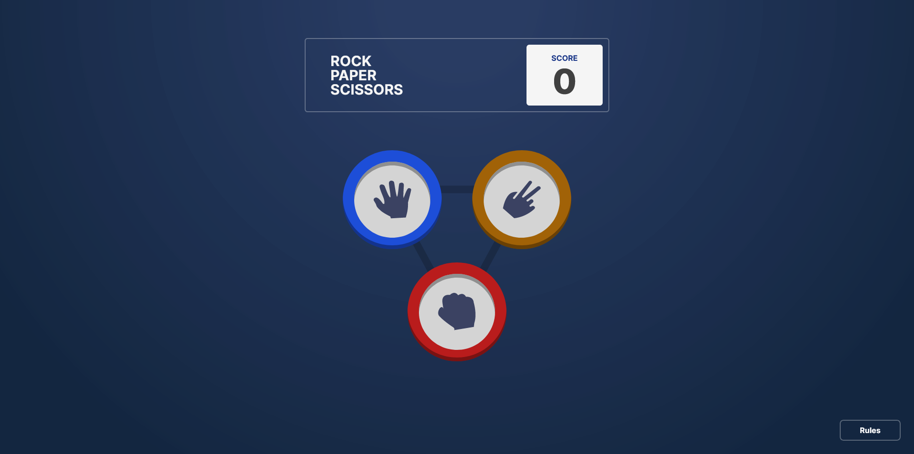
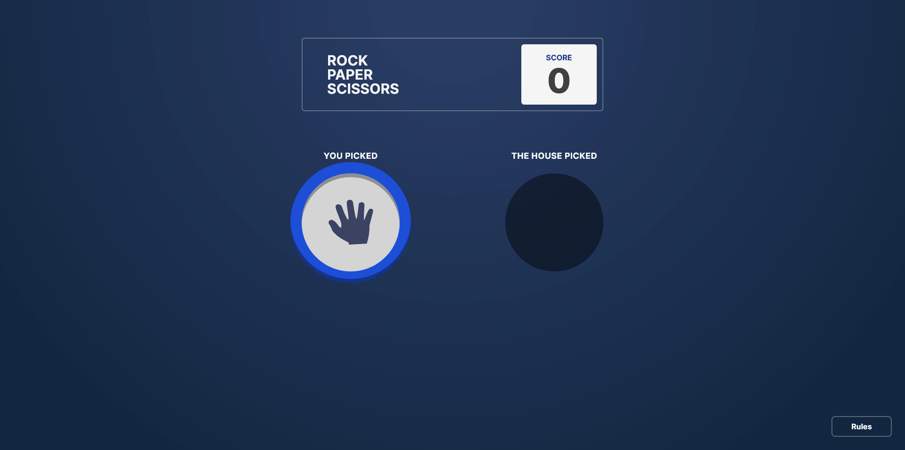
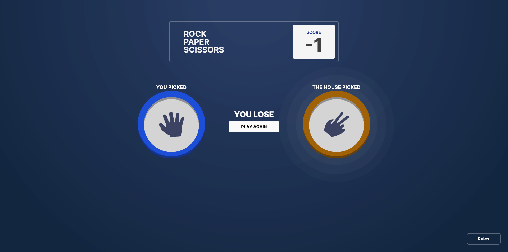

## rock-paper-scissors-next.js

This project is a showcase of a web application designed for playing the classic game of Rock, Paper, Scissors. The application provides a user-friendly interface and robust functionality to facilitate seamless gameplay. It is highly performant, ensuring efficient and real-time game updates.

## Showcase

### Start page, here you can select the option to face the CPU



### User has selected the option and is now waiting for the CPU's choice



### Unfortunately, the user lost because the CPU chose scissors 😔



## Creation Process

Technologies used: Next.js, TailwindCSS, Zod, TanStack Query(React Query)

This project is a web-based implementation of the classic game Rock, Paper, Scissors, built using the dynamic and adaptable Next.js framework. The primary aim of this venture was to create a robust and high-performance game platform, facilitating users to play Rock, Paper, Scissors effortlessly online.

Throughout the development phase, the design aspect of the game was given significant attention, alongside a strong emphasis on functionality and performance. The goal was to ensure the gameplay was not only swift but also reliable and intuitive for users.

With a focus on speed and efficiency, the project strives to deliver an exceptional user experience. Users can swiftly start a new game and play Rock, Paper, Scissors.

## Key Features

- ✔️ Intuitive Gameplay: Facilitates users to play Rock, Paper, Scissors effortlessly online against a CPU opponent.
- ✔️ Dynamic UI: Built with Next.js and TailwindCSS, the game interface is robust, adaptable, and user-friendly.
- ✔️ Real-time Updates: The game state updates in real-time, providing a seamless gaming experience.
- ✔️ CPU Opponent: The game features a CPU opponent.

This is a [Next.js](https://nextjs.org/) project bootstrapped with [`create-next-app`](https://github.com/vercel/next.js/tree/canary/packages/create-next-app).

## Getting Started

First, run the development server:

```bash
npm run dev
# or
yarn dev
# or
pnpm dev
# or
bun dev
```

Open [http://localhost:3000](http://localhost:3000) with your browser to see the result.

You can start editing the page by modifying `app/page.tsx`. The page auto-updates as you edit the file.

This project uses [`next/font`](https://nextjs.org/docs/basic-features/font-optimization) to automatically optimize and load Inter, a custom Google Font.

## Learn More

To learn more about Next.js, take a look at the following resources:

- [Next.js Documentation](https://nextjs.org/docs) - learn about Next.js features and API.
- [Learn Next.js](https://nextjs.org/learn) - an interactive Next.js tutorial.

You can check out [the Next.js GitHub repository](https://github.com/vercel/next.js/) - your feedback and contributions are welcome!

## Deploy on Vercel

The easiest way to deploy your Next.js app is to use the [Vercel Platform](https://vercel.com/new?utm_medium=default-template&filter=next.js&utm_source=create-next-app&utm_campaign=create-next-app-readme) from the creators of Next.js.

Check out our [Next.js deployment documentation](https://nextjs.org/docs/deployment) for more details.
